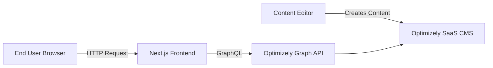
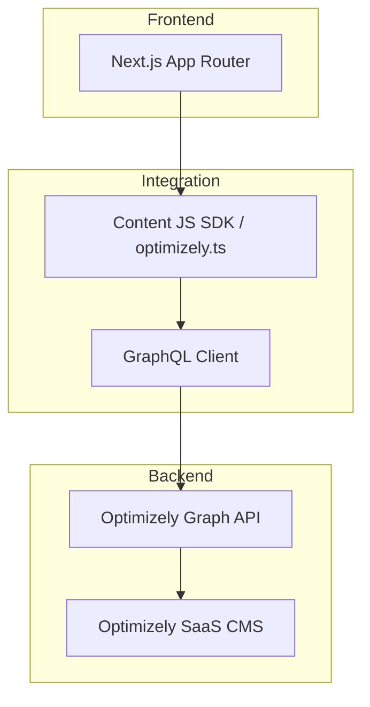
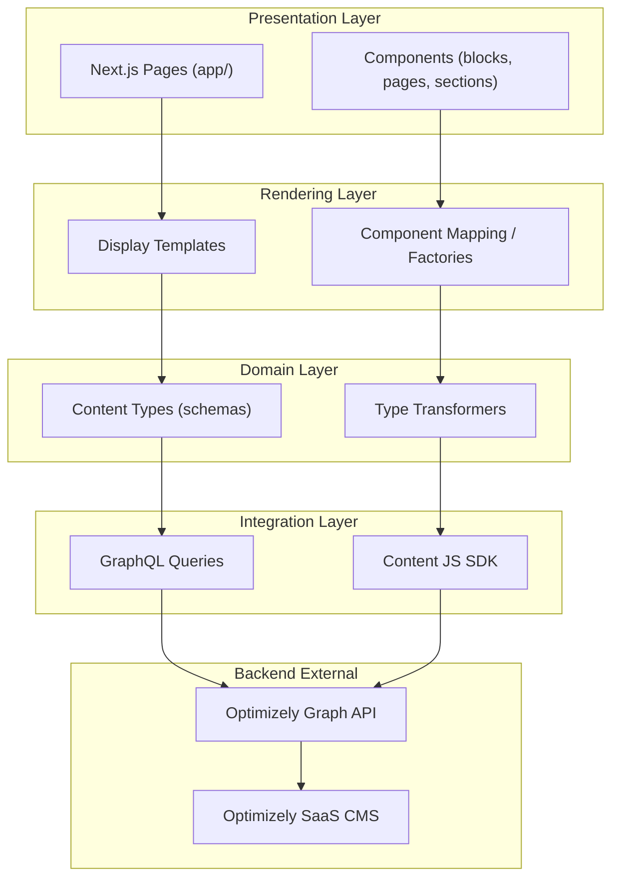
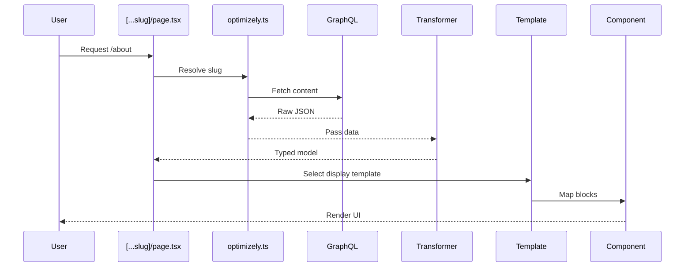
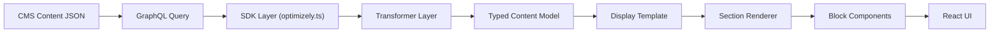
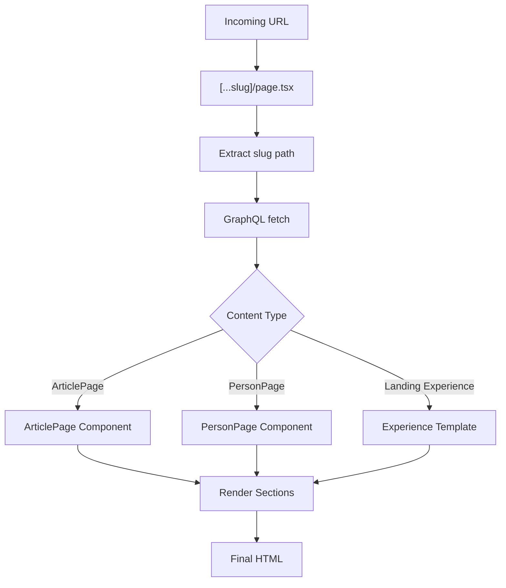
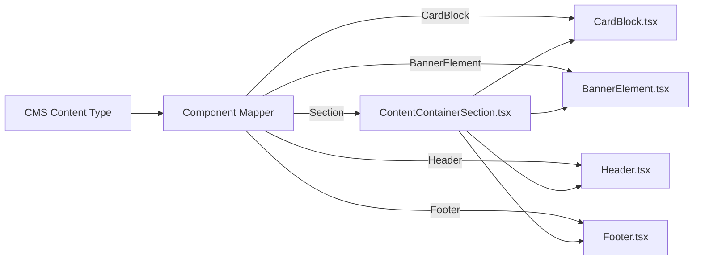
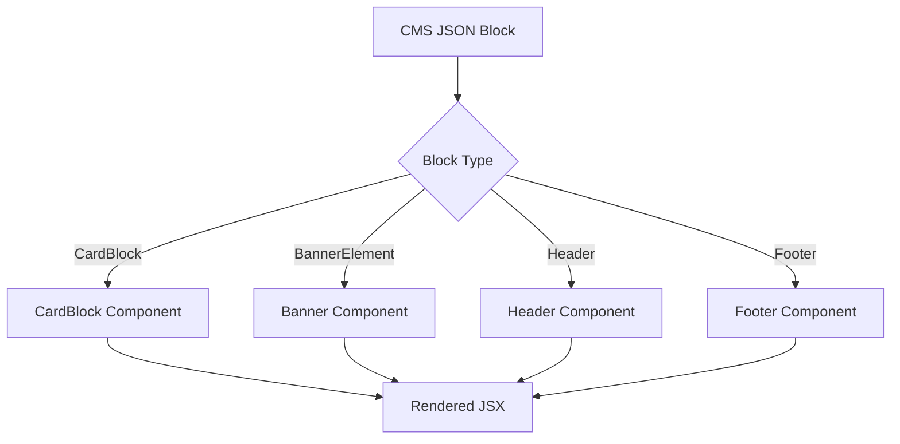
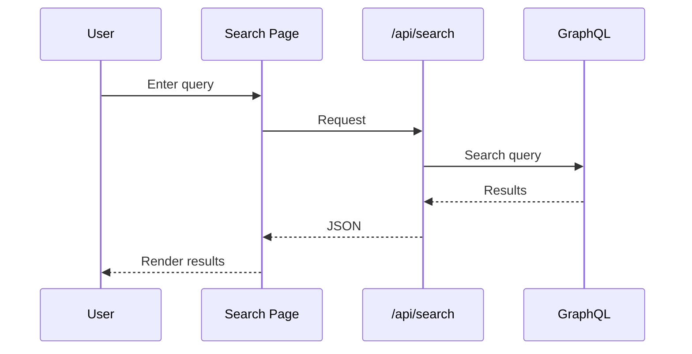
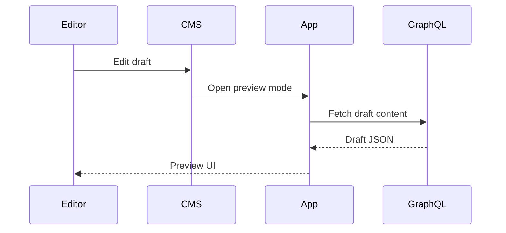

# 🧩 Layer, Component, Sequence, Request Flow Architecture Diagrams

This project is a **Next.js (App Router) application integrated with Optimizely SaaS CMS using the Content JS SDK**. It follows a modular and scalable architecture designed to separate content, presentation, and data-fetching logic.

The structure is built around **CMS-driven development**, where content models defined in Optimizely are mapped to frontend components and rendering templates.

## 🧠 Key Architectural Patterns

- ✅ 1. Headless CMS
  - Backend (CMS) decoupled from frontend

- ✅ 2. Component Mapping Pattern
  - CMS Type → Component Enables runtime rendering flexibility

- ✅ 3. Template-Driven Layout
  - Display templates control structure Components focus only on UI

- ✅ 4. Strongly Typed Content Layer
  - content-types/ = schema transformers = API → UI mapping

- ✅ 5. Layered Architecture
  - App Layer → Templates → Components → Data Layer → CMS

---

## 🌍 C4 Level 1 — Context Diagram

Shows how the system interacts with external actors.

---

## 📦 C4 Level 2 — Container Diagram

Shows major deployable units.

---

## 🧠 C4 Level 3 — Component Diagram (REAL STRUCTURE)

This reflects your actual repo layers.

---

## 🧩 C4 Level 4 — Code-Level Rendering Flow

Shows how one request flows through the system.

---

## 🔁 Full Rendering Pipeline

---

## 🧭 Dynamic Routing (Core Engine)

---

## 🧩 Component Mapping Registry (CRITICAL)

This is the core extensibility pattern in your system.

---

## ⚙️ Internal Mapping Flow (Detailed)

---

## 🔎 Search Flow Architecture

---

## 👀 Preview Flow (Draft Content)

---

## 🚀 Summary

This architecture enables:

- ✅ Fully dynamic CMS-driven pages
- ✅ Strong separation of concerns
- ✅ High scalability and extensibility
- ✅ Clean domain-driven structure
- ✅ Flexible UI composition
